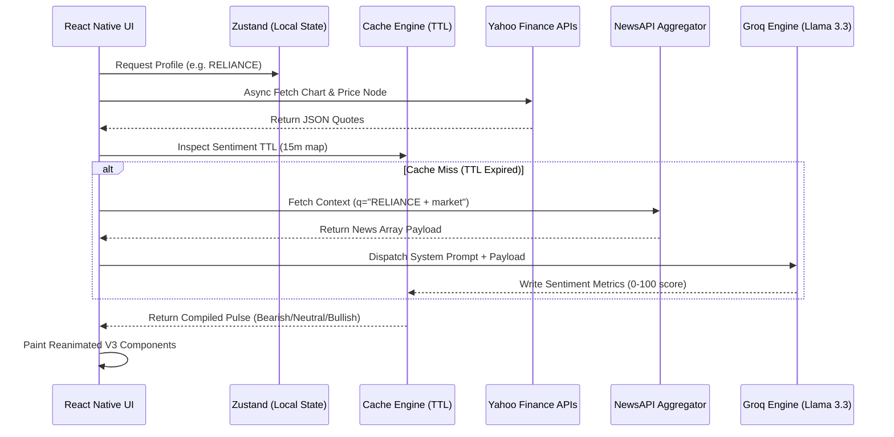

<div align="center">
  <h1>📈 StockPulse</h1>
  <p><strong>AI-Powered Real-Time Stock Sentiment Tracker & Analytics Platform</strong></p>

  <p>
    
    
    
    
  </p>
</div>

<br />

StockPulse is a production-grade Mobile Application built specifically for the Indian retail investor. It bridges the gap between raw market data and actionable insights by taking real-time news streams and pushing them through advanced Large Language Models (LLMs) to formulate an instant, on-device "Sentiment Pulse."

## 📱 Visual Overview
> *Replace these placeholders with real application screenshots.*

| Watchlist / Dashboard | AI Sentiment Engine | Market Search |
| :---: | :---: | :---: |
|  |  |  |

---

## ✨ System Features

*   **Live Market Analytics:** Direct asynchronous telemetry processing from the Yahoo Finance REST APIs rendering live OHLC (Open, High, Low, Close) metrics.
*   **Groq-Powered Sentiment Engine:** Integrates the ultra-low latency **Llama 3.3 (70B-versatile)** model. The system pulls and parses recent web-crawled news context to dynamically grade the asset's trajectory in a strict `[0-100]` constraint.
*   **Optimized Persistence Layer:** Encapsulated local storage wrapped via `AsyncStorage` and synced securely with `Zustand` state management to ensure Zero-Layout-Shift on recurring app launches.
*   **Engineered UI:** Component hierarchy mapped fully with NativeWind (Tailwind mapped for React Native), heavily inspired by strictly-typed Fintech architectures (e.g., Groww) featuring customized dark-mode hex standards (`#0A0E1A`, `#00D09C`).
*   **Hardware-Accelerated Animation:** Complex SVG trigonometric components (the Semicircular Sentiment Gauge) mapped and rendered strictly on the UI thread using **Reanimated v3** to prevent dropping JS frames.

---

## 🏗 Architecture & Data Flow

When a user taps into an equity screen, three critical sub-systems operate in tandem:

1.  **Metric Resolution:** A direct REST `GET` against `query1.finance.yahoo.com` pulls current equity states.
2.  **Context Assembly:** Parallel instantiation hits `NewsAPI` leveraging exact string matches spanning the past 7 days to compile a maximum semantic payload array.
3.  **Inference & Caching:** The array is sent securely to Groq's API endpoint. Because LLM processing requires tokens and bandwidth outlays, the application invokes a lightweight TTL (Time-to-Live) `Cache Module` enforcing a strict 15-minute freeze on API calls per unique ticker to heavily limit bandwidth saturation.

### Architecture Diagram



---

## 🛠 Technology Stack

This application heavily leverages an **Expo Managed Workflow** bounded internally to **SDK 54+**, utilizing strictly `react-native-reanimated@3.16.1` and `NativeWind v2` for absolute bridging stability across modern RN architectures.

| Domain                 | Technology / Library                                                  |
| :--------------------- | :-------------------------------------------------------------------- |
| **Mobile Core**        | React Native (`0.74+`), Expo, TypeScript Strict Mode                  |
| **Routing / Nav**      | React Navigation v6 (Bottom Tabs + Native Stack)                       |
| **Styling & Theming**  | NativeWind (Tailwind CSS v3 logic mappings)                           |
| **Telemetry State**    | Zustand + Async Storage Persistence                                   |
| **Network Client**     | Axios (with configurable interceptors potential)                       |
| **Data Visualizations**| `react-native-chart-kit`, `react-native-svg`                           |
| **Inference Engine**   | Groq Cloud API, Llama-3.3-70b-versatile                               |

---

## 🚀 Local Development & Setup

### 1. Prerequisites
Ensure you have the latest environment setup for React Native Expo workflows:
*   [Node.js](https://nodejs.org/) (v18+)
*   Expo Go app on your physical mobile device (iOS App Store / Android Play Store)

### 2. Standard Installation

```bash
# Clone the repository locally
git clone https://github.com/Adinair01/Stock-Pulse.git
cd Stock-Pulse

# Install specific NPM dependency tree
npm install
```

### 3. Environment Secrets (API Configuration)
You must implement a local environment structure. Simply duplicate the template:

```bash
cp .env.example .env
```
Inside `.env`, populate the variables:
*   `NEWSAPI_KEY`: Requires a developer key from [NewsAPI.org](https://newsapi.org/)
*   `GROQ_API_KEY`: Requires a cloud endpoint key from [Groq Console](https://console.groq.com/keys)

*(Note: Never commit your `.env` file! It is heavily ignored in `.gitignore` by default.)*

### 4. Running the Bundler
Execute the Metro continuous bundler:
```bash
npx expo start --clear
```
Once the generic QR code renders in your terminal window, point your iOS/Android camera device directly at the monitor. The Metro packager will construct the bundle natively and transmit the application dynamically.

---

## ⚖️ Engineering Considerations

### Why Zustand over Redux?
In an architecture primarily focused on raw telemetry readouts, global component states are predominantly isolated to the `Watchlist`. A full Redux store boilerplate creates excessive noise. Zustand provides transparent mapping arrays perfectly suited for local persistent configurations.

### Handling LLM Drift
To prevent the LLM from hallucinating unstructured text blocks that crash the application's renderer, the system utilizes Groq's explicit `json_object` format parameter combined with a rigorous, tightly mapped System Prompt. It forces the return architecture to precisely mirror the application's internal `SentimentAnalysis` TypeScript interface, gracefully parsing `JSON.parse` failures into heavily isolated fallback variables.

---

## 📄 License & Credits
*   **License:** MIT
*   **Author:** [Aditya Nair](https://github.com/Adinair01)
*   **Inspired By:** The dark, user-friendly financial UI philosophy pioneered by applications standardizing the Indian investing landscape like Groww.
